1. Clone this repository

   

   STRG+SHIFT+P in VSCode:

   
   
2. Enter application folder and build the application using the docker-compose build command:

    ```bash
    docker-compose build
    ```

3. Create new Project in the Industrial Edge Management under **"My Projects" -> "Create Project"**
   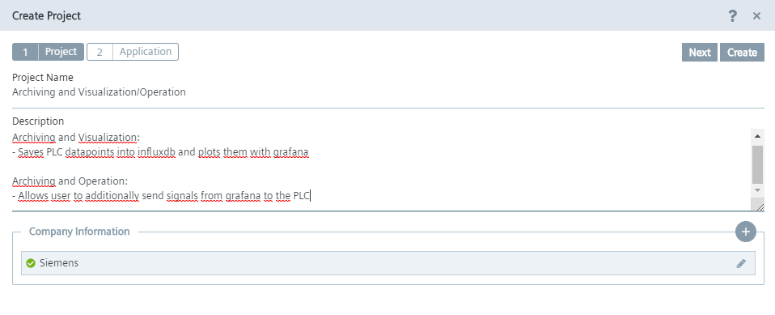

4. Create an Application and specify the required information:
   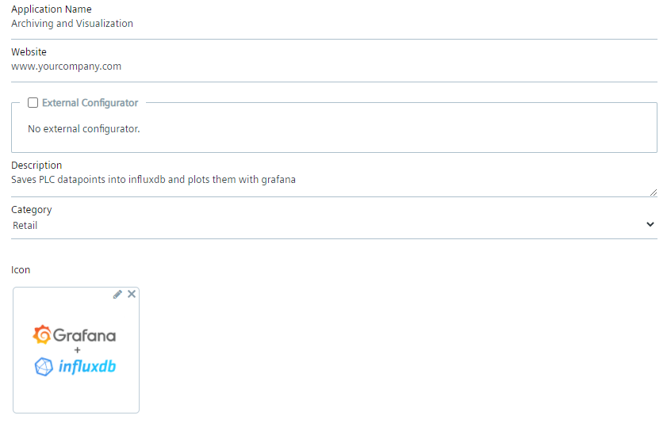

5. Go-To IE Publisher, and select newly created App. Then select **"+Configurations"**
   

6. Add a new Configuration and enter all required fields. In the final step, add the file contained in **/cfg-data/** as a template

   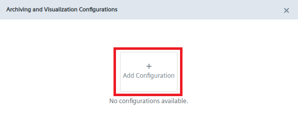

   

7. Now select **"Add New Version"** and select **docker-compose v2.4**
   
   

8. In the top right corner select **"Import YAML file"** and select the **docker-compose.yml** file from your directory. Click **"OK"**

9. **Optional:** Configure a reverse proxy in the "Network"-section of the grafana service: 

  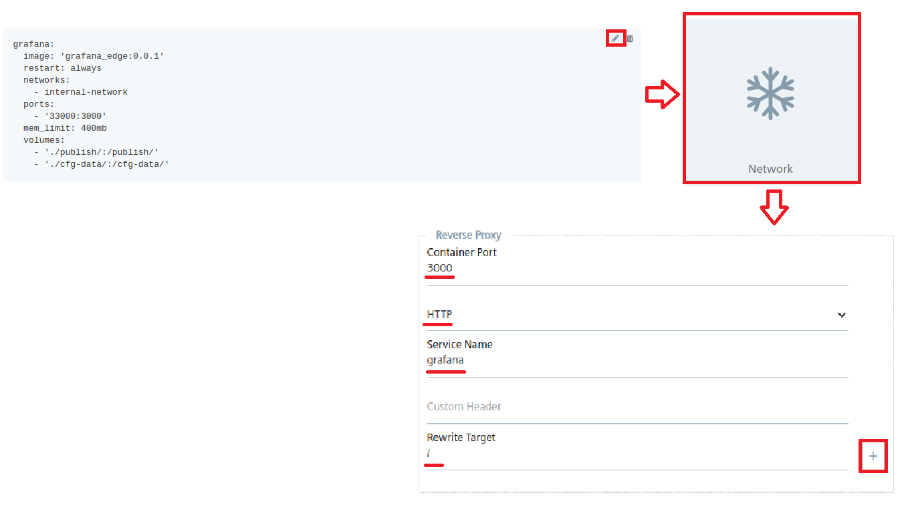

  **Notice:** Port exposure must be removed in this case. To do this, simply select the trash-icon in the very bottom.

  **Save** changes.

10. Select **"Review"** then **"Validate & Create"** on the top right. Then select **"Create"**
    
    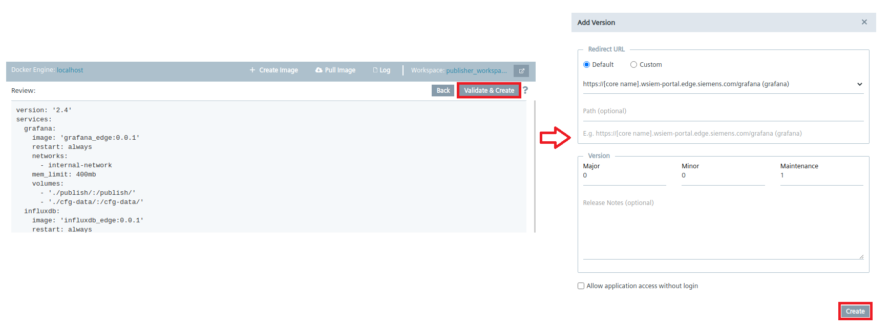

11. Afterwards, select **"Start Upload"**.

   

12. Once the App is successfully uploaded to your IEM, Go-To **"My Projects"** and select the newly created Application. Then select **"Install"**

   

13. In the **"Configurations"**-Tab click on the pencil to review your configuration file. Based on this config, you can configure the Application to use a different database-name, different credentials for the IE Databus or a different Datasource name. "DATA_SOURCE_NAME": "**PLC_1/default**" was selected here because our PLC-Name in SIMATIC S7-Connector is "PLC_1" and we are using Bulk-publish, so we need the keyword "default".

   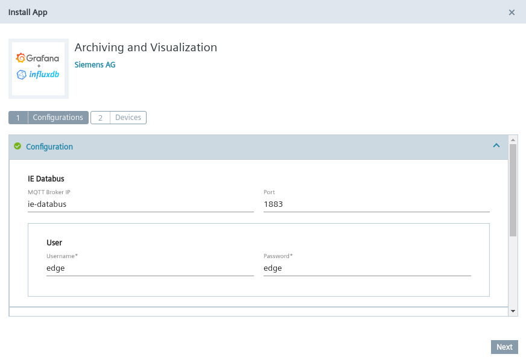

14. Install the Application on your Edge Device and remember to select this configuration file. 

15. Open Grafana and login with following credentials, afterwards change password if needed:
    
    username: **admin**
    password: **admin**

    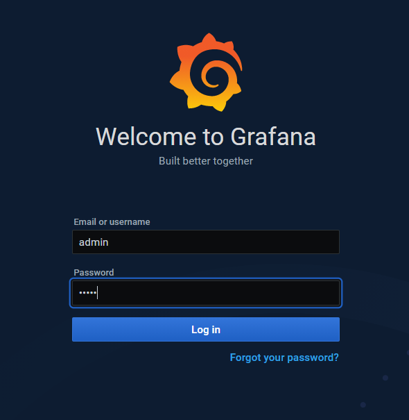
    
16. Go to **Data Sources** 
    
    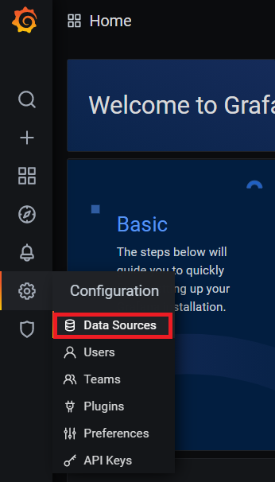

17. add a new Datasource (InfluxDB), and enter the address **influxdb:8086**.

    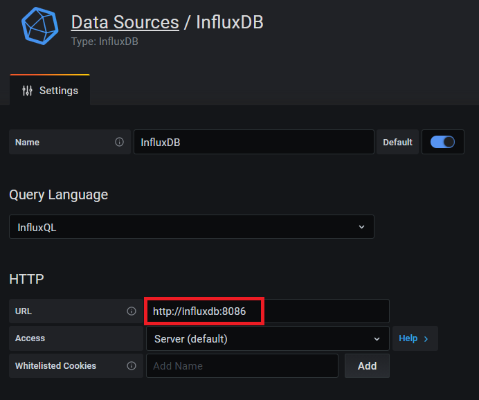

18. In the bottom of the Datasource configuration, enter the database name **databus_values**. Then select **Save & Test**.

    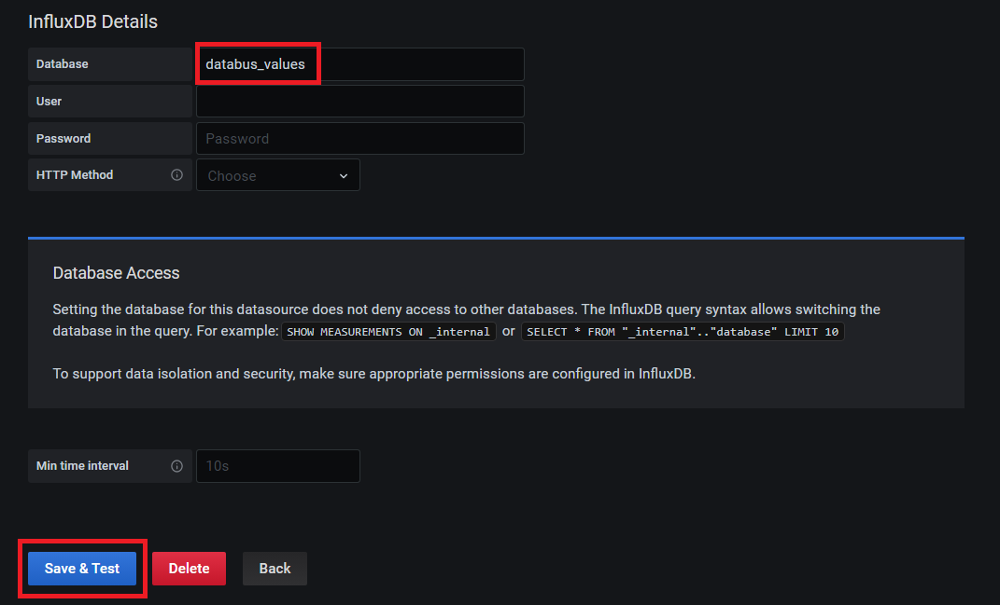

    You should receive a notification "Data source is working". If not, you might have selected a different name in the config file.

19. Make sure the S7-Connector Project is started and your PLC is in Start Mode. Set "GDB".hmiSignals.HMI_Start to TRUE on your PLC. 

20. In Grafana, Add a new Panel in the Dashboard section. You will be able to select and configure your Datapoints.

  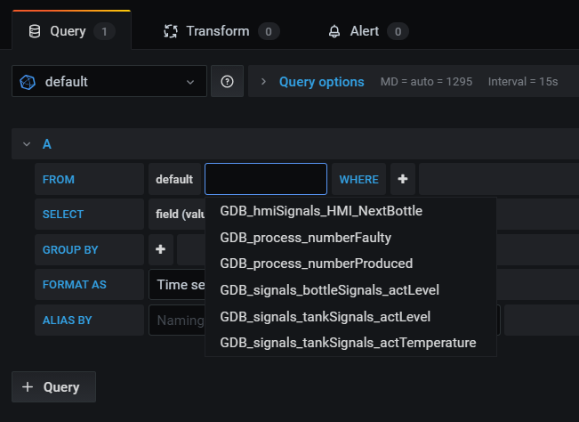

21. Select the values you would like to plot and remove the **"Group By" options** and the **"SELECT mean(value)"** option.

  

22. When finished with the dashboard, save it, then select settings in the top section to export it as a JSON-file. 

  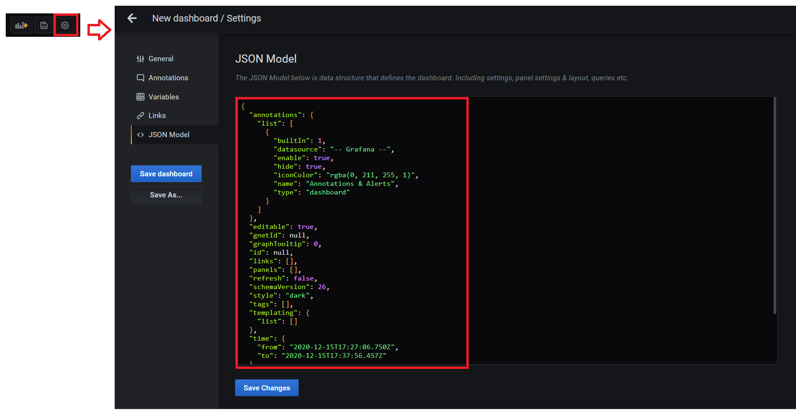

  Save its content as **"operation-panel.json"**. To learn how to incorporate this dashboard into your application, Check out **"Archiving and Operation"**.